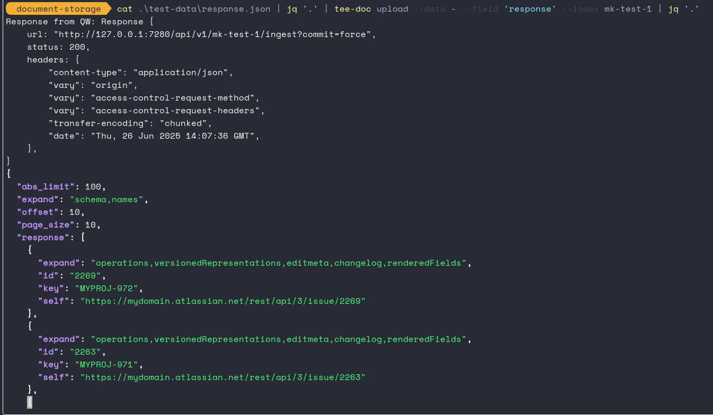

# Document Storage
by Maya Kerostasia

## tee-doc
A JSON object 'tee' program that 

1. takes json as input, 
2. Stores it in a document database ( like quickwit ) 
3. Then returns it as it was input

## Help
```
This is a CLI for Piping JSON data to quickwit. 
It allows you to take output from another command and uploads it to quickwit.


Usage: tee-doc.exe [COMMAND]

Commands:
  upload  Quickwit Upload
  search  Document Search
  help    Print this message or the help of the given subcommand(s)

Options:
  -h, --help
          Print help (see a summary with '-h')

  -V, --version
          Print version
```

## Example

